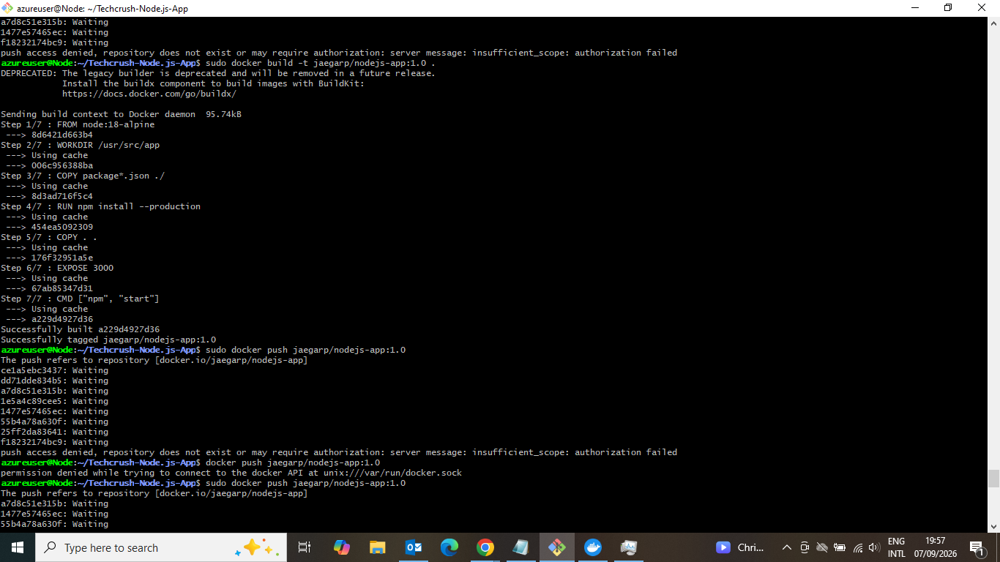
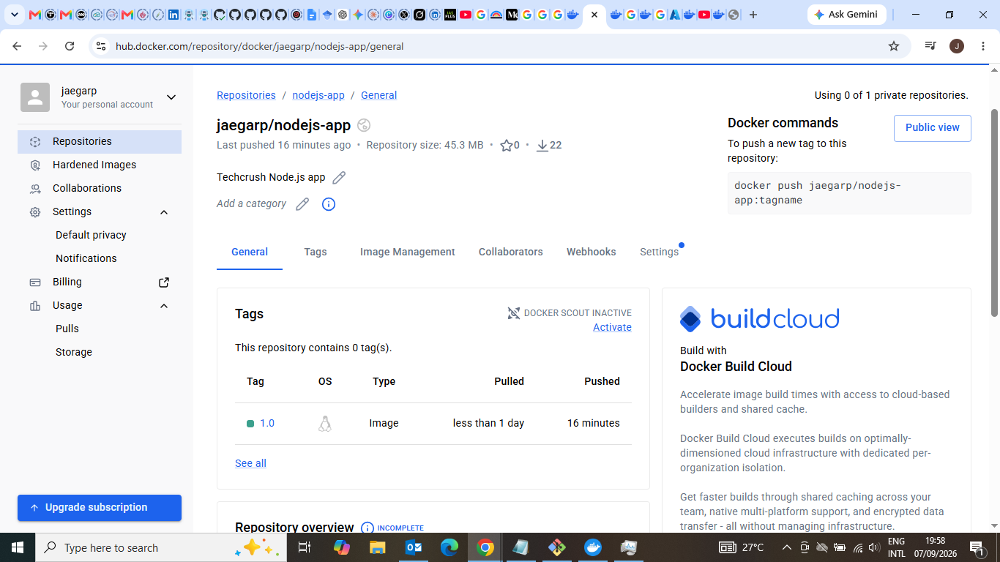
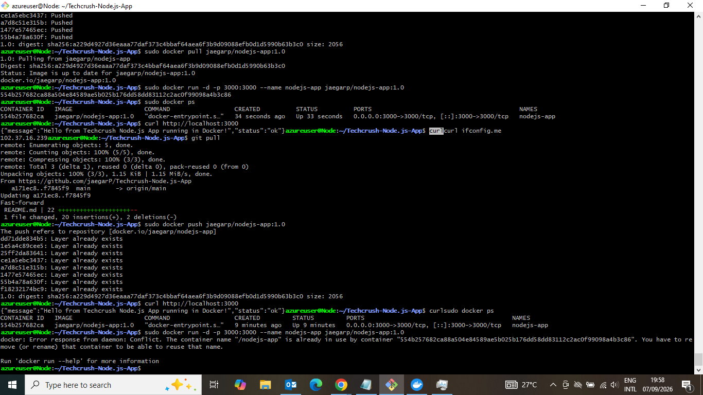
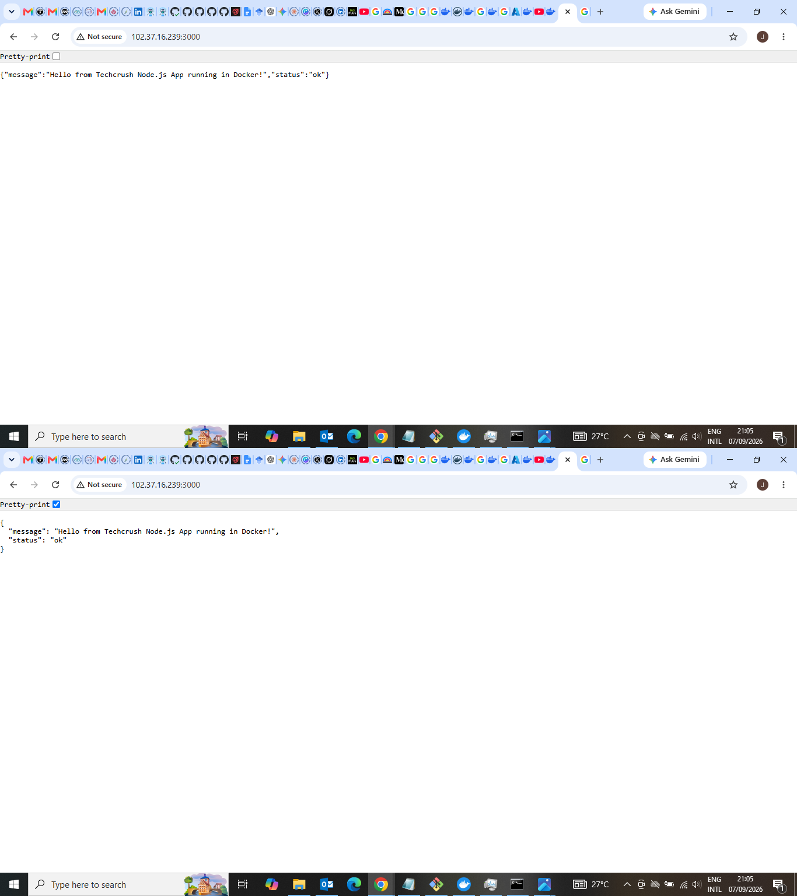

# Techcrush Node.js-App

A Node.js app containerized with Docker and published to Docker Hub.

## Run locally
npm install && npm start

## Docker
docker build -t jaegarp/nodejs-app:1.0 .
docker run -d -p 3000:3000 jaegarp/nodejs-app:1.0

## Screenshots
### 1. Docker Build

### 2. Docker Hub Image

### 3. Running Container

### 4. Live Application

